md
# 🍽️ Restaurant Management System

A responsive restaurant management system developed with **HTML, CSS, and JavaScript**.

The application is for staff use only. This will allow them to manage dishes, orders, and stock in an easy way. The interface is designed to be user friendly since it doesn't require many steps to complete one order, dish or to add into the stock. 

The colors were inspired in Kirby's design since it's a friendly character, and one that devours everything he sees, so it was thought as a good mascot for the project. 

---

# 📐 Wireframes

<table>
<tr>
<td align="center">
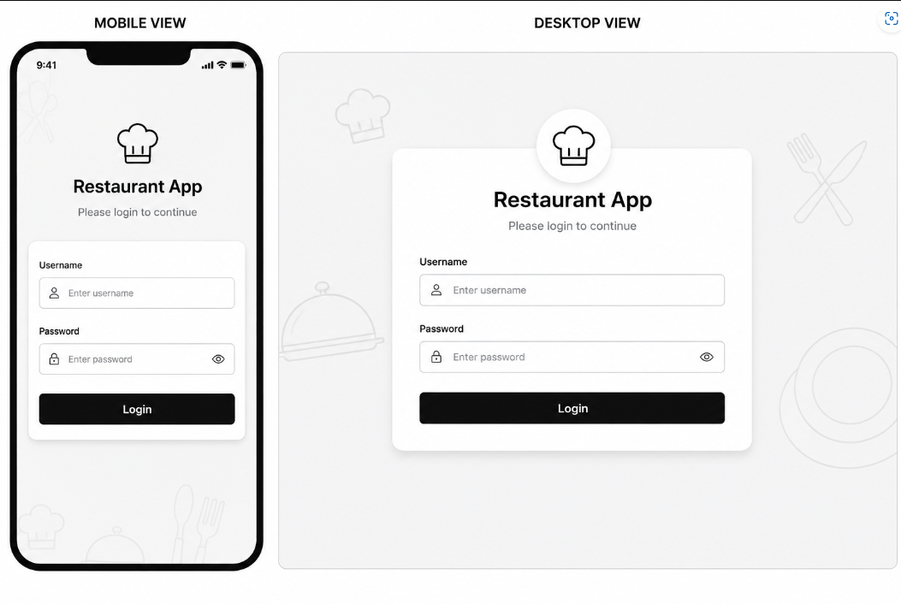<br>
<b>Login</b>
</td>

<td align="center">
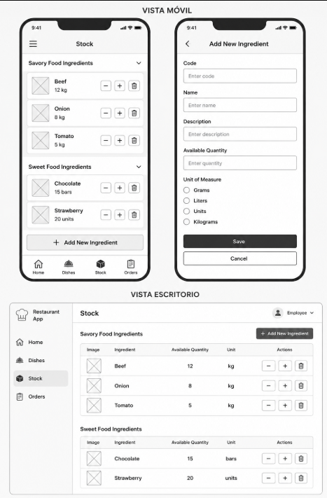<br>
<b>Stock</b>
</td>

<td align="center">
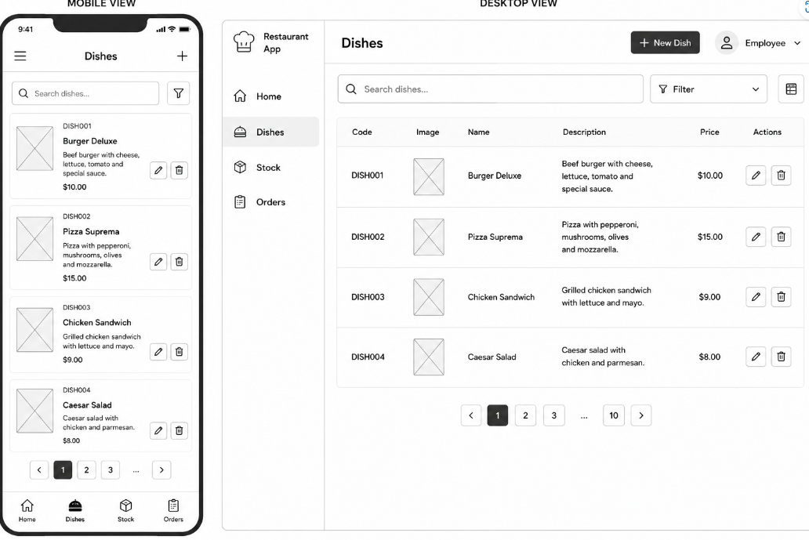<br>
<b>Dishes</b>
</td>

<td align="center">
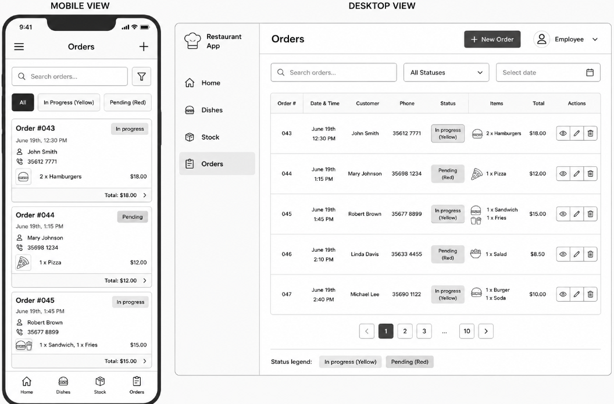<br>
<b>Orders</b>
</td>
</tr>
</table>

---

# 📸 Application Screenshots

### Login

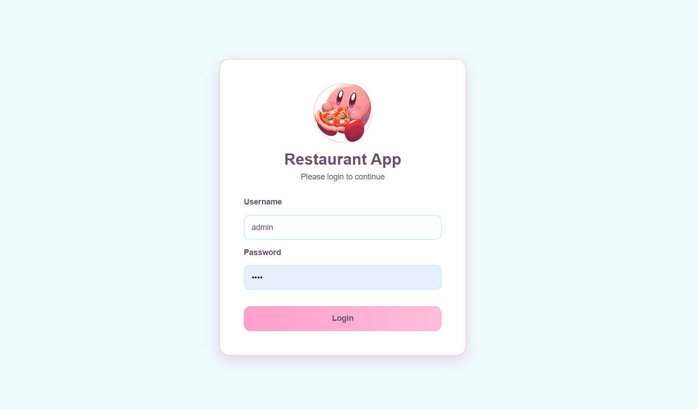

---

### Stock

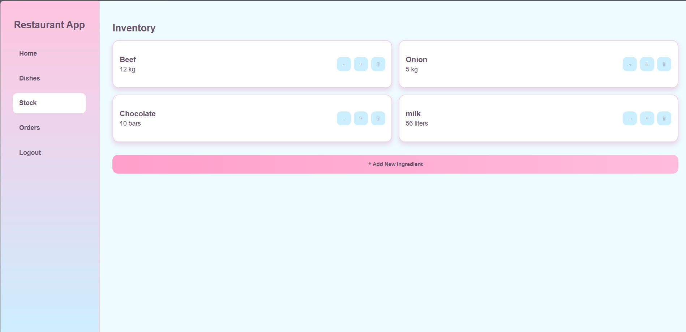

---

### Dishes

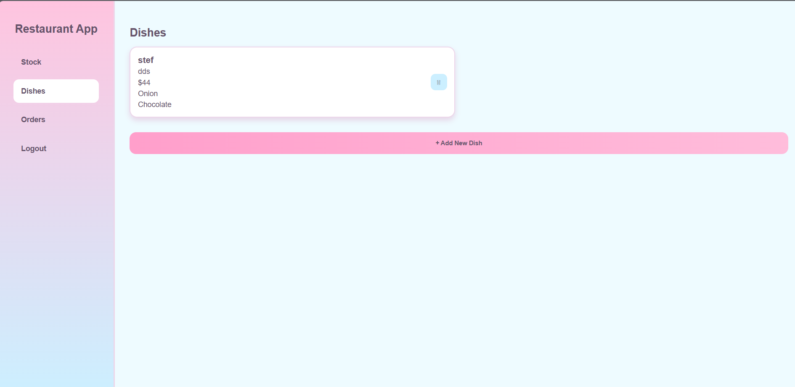

---

### Orders

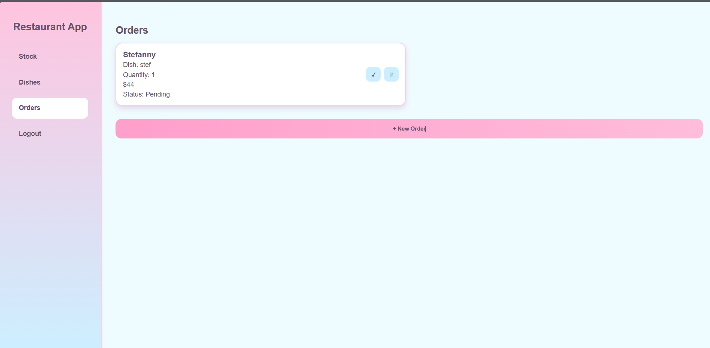

---
# 📸 Application Mobile Screenshots

<table>
<tr>
<td align="center">
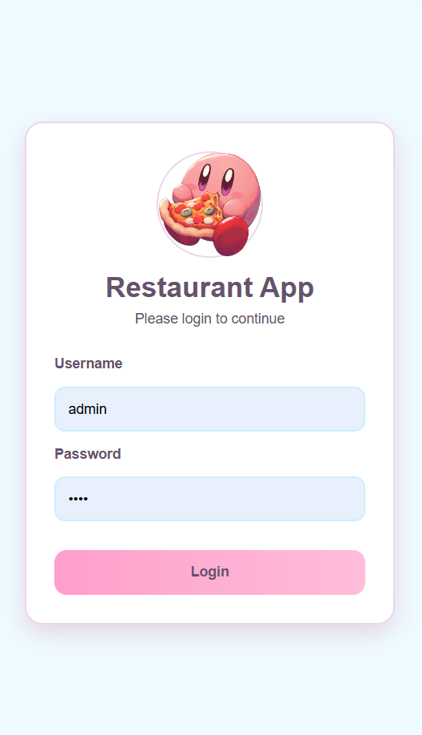<br>
<b>Login</b>
</td>

<td align="center">
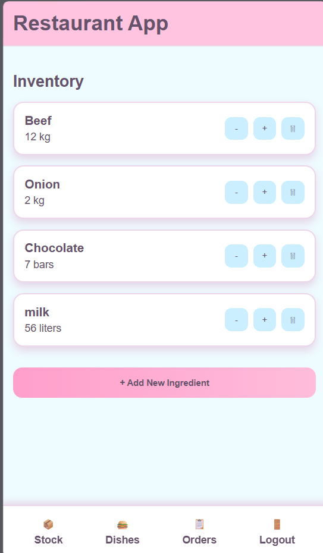<br>
<b>Stock</b>
</td>

<td align="center">
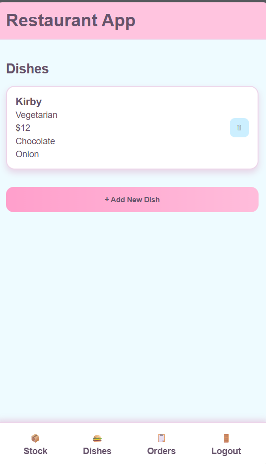<br>
<b>Dishes</b>
</td>

<td align="center">
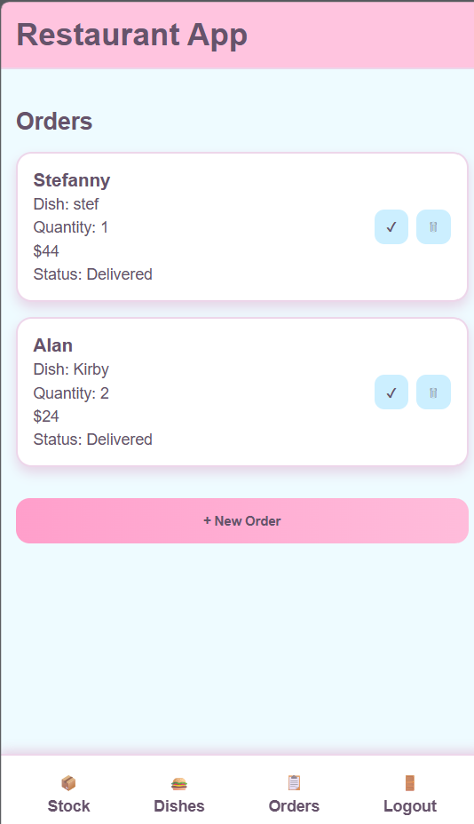<br>
<b>Orders</b>
</td>
</tr>
</table>

# ✨ Features

- User login.
- Ingredient inventory management.
- Create new ingredients.
- Increase or decrease stock quantity.
- Delete ingredients.
- Create dishes using available ingredients.
- Display dishes with their ingredients.
- Create customer orders.
- Automatic order total calculation.
- Order status:
  - Pending
  - In Progress
  - Delivered
- Automatic stock consumption when creating orders.
- Responsive design for desktop and mobile devices.
- LocalStorage data persistence.

---

# 💻 Technologies

- HTML5
- CSS3
- JavaScript (Vanilla)
- LocalStorage

---

# 📂 Project Structure

```

Restaurant-App/

│

├── index.html
├── stock.html
├── dishes.html
├── orders.html

│

├── css/
│   └── styles.css

│

├── js/
│   ├── index.js
│   ├── stock.js
│   ├── dishes.js
│   └── orders.js

│

├── img/

│

└── README.md

```

---

# 📱 Responsive Design

The application was developed following responsive design principles.

Layouts automatically adapt to:

- Mobile devices
- Tablets
- Desktop screens

The interface uses CSS Grid, Flexbox and media queries to provide a consistent experience across different screen sizes.

---

# 🎨 UI / UX

The interface was designed using a soft pastel color palette inspired by Kirby.

UI/UX considerations include:

- Clean navigation
- Simple forms
- Responsive layout
- Consistent buttons
- Friendly visual feedback
- Easy-to-read typography

---

# 🚀 Installation

Clone the repository.

```

git clone https://github.com/StefannyEstevezSolares/RestaurantProject

```

Open **index.html** in your browser.

Default credentials:

```

Username:
admin

Password:
1234

```

---

# 👩‍💻 Author

**Stefanny Estevez**

Front-End Development Project

HTML • CSS • JavaScript

